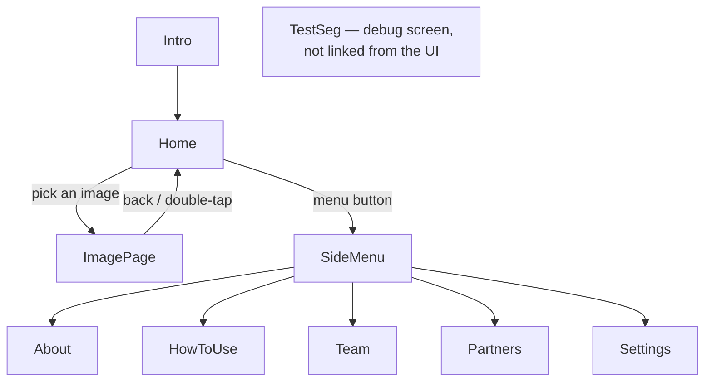
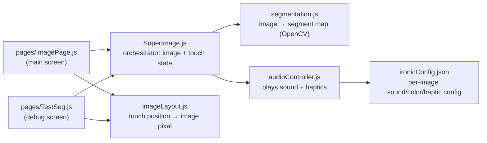

# Stellasonos

Stellasonos is a mobile app that turns astronomical images into sound, so
blind and low-vision users can explore images from telescopes like Chandra
by touch and hearing instead of sight. Touching different parts of an
image triggers different sounds and haptic feedback, based on what that
part of the image contains (a bright core, a jet, background noise, etc.).

NASA Chandra-funded. Built with React Native for iOS and Android.

## Repo map

```
StellasonosApp/
├── App.js, index.js       — app entry points
├── pages/                 — screens (React Navigation)
│   ├── Home.js
│   ├── ImagePage.js        — the main touch-to-explore screen
│   ├── TestSeg.js          — debug screen for visualizing segmentation output
│   ├── HowToUse.js, Intro.js, Partners.js, Settings.js, SideMenu.js, Team.js, About.js
├── utils/                 — core logic (no UI)
│   ├── SuperImage.js        — orchestrator: image state + touch position,
│   │                          wires segmentation.js and audioController.js together
│   ├── segmentation.js      — OpenCV image segmentation pipeline (self-contained,
│   │                          designed to be swappable — see docs/CODE_OVERVIEW.md)
│   ├── audioController.js   — sound + haptic playback for a touched segment
│   ├── imageLayout.js       — touch position → image pixel math (used by
│   │                          ImagePage.js and TestSeg.js, so there's one copy)
│   ├── ironicConfig.json    — per-image config: which segment maps to which
│   │                          sound/color/haptic
│   ├── styles.js
│   └── kmeans/               — an earlier, discontinued segmentation approach
│                               (kept for reference; see utils/kmeans/README)
├── assets/                — images, icons
├── android/, ios/          — native project files
└── docs/                  — deeper documentation (see docs/CODE_OVERVIEW.md)
```

## App structure

**Screen navigation** (`App.js`, a React Navigation stack):



**How a touch turns into sound** (the core `utils/` modules):



For how `utils/` fits together in more detail (function signatures, what's
safe to swap out, known issues) see [`docs/CODE_OVERVIEW.md`](docs/CODE_OVERVIEW.md).

## Setup

**Requirements:** Node, Xcode (for iOS) or Android Studio (for Android),
CocoaPods. Follow React Native's
[Set Up Your Environment](https://reactnative.dev/docs/set-up-your-environment)
guide if you haven't already.

```sh
npm install
```

**iOS** (first time, and any time native dependencies change):
```sh
bundle install
bundle exec pod install
npm run ios
```

**Android:**
```sh
npm run android
```

**Start Metro manually** (usually not needed — `npm run ios`/`npm run android`
starts it for you):
```sh
npm start
```

## Team / acknowledgments

Developed by Tiffany Gao and Ning Lan, under mentors Tom Sgouros and Kim
Arcand. Connects to the STFC-funded Tactile Universe project via Dr.
Nicolas Bonne (University of Portsmouth).