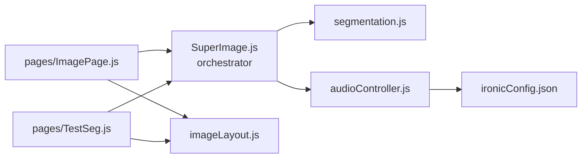

# Stellasonos — `utils/` code overview

This documents how the image → segmentation → sound pipeline is organized.

## The four files

```
utils/
├── segmentation.js     ← turns an image into a segment map (OpenCV)
├── audioController.js  ← plays sound + haptics for a segment
├── imageLayout.js      ← touch position → image pixel coordinate (pure math)
└── SuperImage.js        ← orchestrator: owns state, wires the above together
```



### `segmentation.js` 

The segmentation code is completly contained and swappable. If you would like to swap out the current segmetnation logic with an improved version, edit it in `segmentation.js` . 

**Entry point:**

```js
runSegmentation(imageSrc, win, segmentData, starData, fillRGBArray, allocateDisplayBuffer)
  → Promise<{ matJS, countStar }>
```

| | |
|---|---|
| **In** | `imageSrc` (string URL), `win` (mutable `{winWidth, winHeight, imgWidth, imgHeight}` — `imgWidth`/`imgHeight` get overwritten once the real size is known) |
| **In (mutated)** | `segmentData` (array, one entry per pixel — gets filled in), `starData` (object, star pixels keyed by index — gets filled in) |
| **In (callback)** | `fillRGBArray(idx, r, g, b, a)` — called once per pixel to paint a display buffer; `allocateDisplayBuffer(win)` — optional, called once real size is known, before pixels are classified |
| **Out** | `{ matJS, countStar }` — `matJS` is the thresholded image (used for a debug preview), `countStar` is how many star-sized specks were found |

Internally it's the five steps : download → resize (1/3) →
grayscale + adaptive threshold → connected components → classify each pixel
into star / top-10-segment / background. Each step is still its own
exported function (`fetchImageAsBase64`, `resizeImage`, `applyThreshold`,
`runConnectedComponents`, `getTopSegmentLabels`, `classifyPixels`) in case
you need one on its own.

**To swap the segmentation approach for something else** (e.g. resurrecting
`utils/kmeans/`, or a future approach): write a new `runSegmentation` with
the same signature above, point `SuperImage.js`'s import at it, and nothing
else in the app needs to change.

### `audioController.js` — sound + haptics

A small class, `AudioController`, that owns everything about playback: the
`Player` instances, which segment is currently active, the touch-count per
segment, and the haptic trigger.

```js
new AudioController(imageConfig, initialVolume)
```

| Method | What it does |
|---|---|
| `init()` | Builds + prepares a `Player` for every segment with a sound URL |
| `setCompletionCallback(cb)` | Fires `cb` once all players are prepared |
| `playSegment(segmentKey)` | Plays that segment's sound + haptic, stopping whatever was playing |
| `stop(cb)` | Stops playback |
| `restartCurrent()` | Replays the active sound from the top |
| `updateVolume(segmentKey, vol)` | Adjusts one player's volume |
| `getSegmentInfo(segmentKey)` | Returns the stored config (sound/color/haptic/touch count) for a segment |
| `destroy()` | Tears down all players and timers |

### `SuperImage.js` — orchestrator

Owns image state (`layers`, `win`, `segmentData`, `displaySeg`) and touch
position math (`getPos`), and delegates to the two modules above:

- `performSegmentation()` calls `runSegmentation(...)` from `segmentation.js`,
  then `this.audio.init()`.
- `play(x, y)` figures out which segment was touched, then calls
  `this.audio.playSegment(...)`.
- `stopSound()`, `getSegmentInfo()`, `updateVolume()`, `destroy()`,
  `setCompletionCallback()` are thin pass-throughs to `this.audio`.

### `imageLayout.js` — touch position → image pixel

Two pure functions. Given a touch and the current
display size, figure out which image pixel that corresponds to.

| Function | What it does |
|---|---|
| `displayToImageCoords(displayX, displayY, displayWidth, displayHeight, rotate, imgW, imgH)` | Converts a touch on the displayed image into a clamped `{x, y}` pixel coordinate on the underlying image. Handles the 270° rotation used for wide images on portrait screens. |
| `getFitSize(imgW, imgH, maxW, maxH)` | Returns the largest `{width, height}` that fits an image inside a box while keeping its aspect ratio. |

Used by both `pages/ImagePage.js` and `pages/TestSeg.js` — previously each
page had its own inline copy of this math; now there's one copy both share.

## Known pre-existing issue

`getColorAt(x, y)` reads `pos.mx` / `pos.my`, but `getPos()` returns
`{x, y}` 

Those fields don't exist, so `getColorAt` currently always
returns white (`"#ffffff"`). Worth a follow-up fix (likely
`pos.x` / `pos.y`).